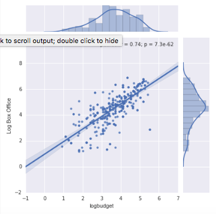
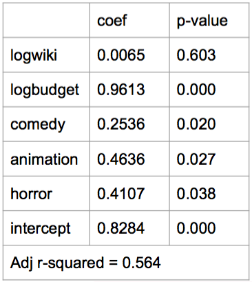

Wiki traffic data seems to be a good proxy for audience interest in a movie relatively close to a movie's release.  But does this trend hold as we increase the timespan?

As seen in figure 1, there seems to be a loose relationship at best between wiki views and future box office revenue, when looking at wiki page views at least one year in advance of the release date.

Compare this to figure 2, where the relationship between between a movie's production budget and it's future box office revenue is much clearer.

Table 1 has a sparse model with wiki views as the only predictor and future box office revenue as the outcome.  

Table 2 includes production budget and genre - specifically, note how adding these additional predictors causes wiki views to completely lose what little predictive power it had.

